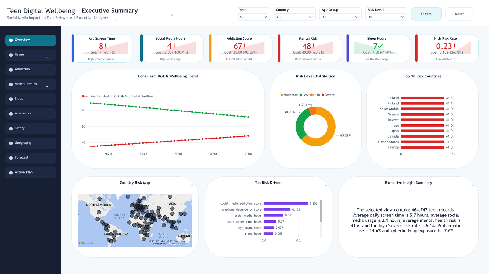
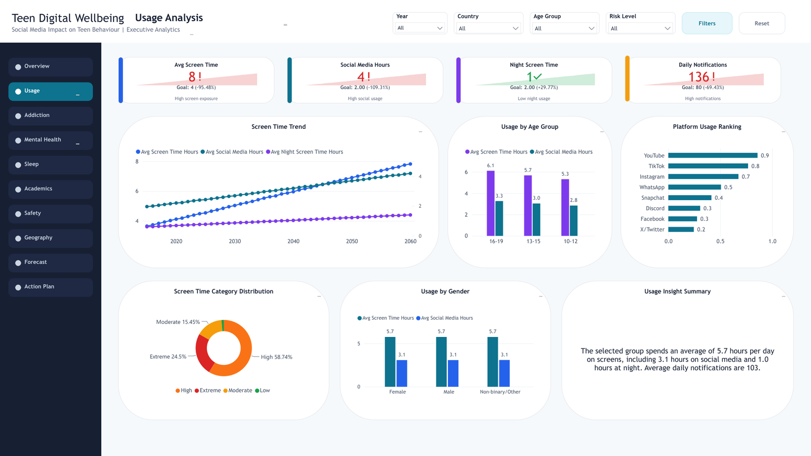
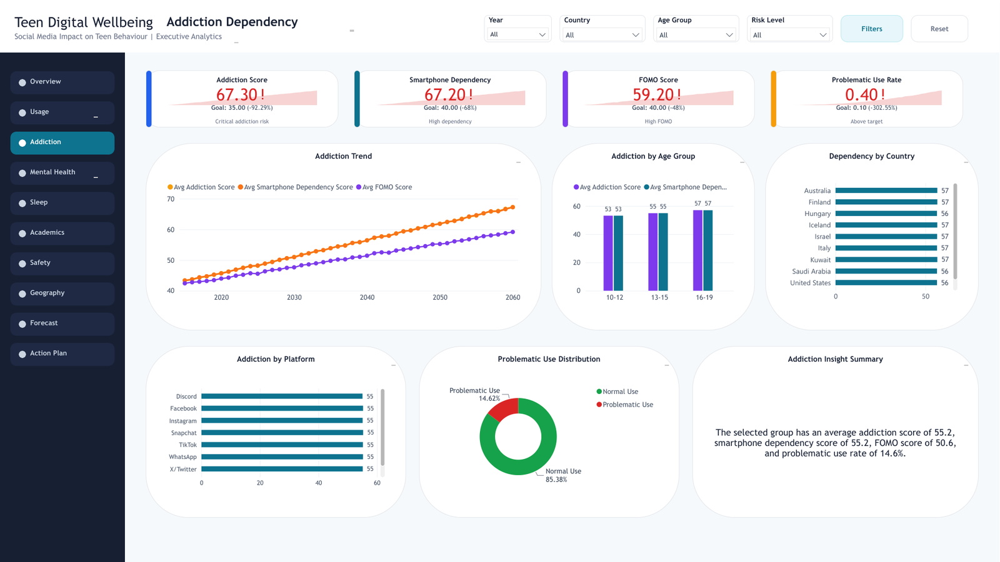
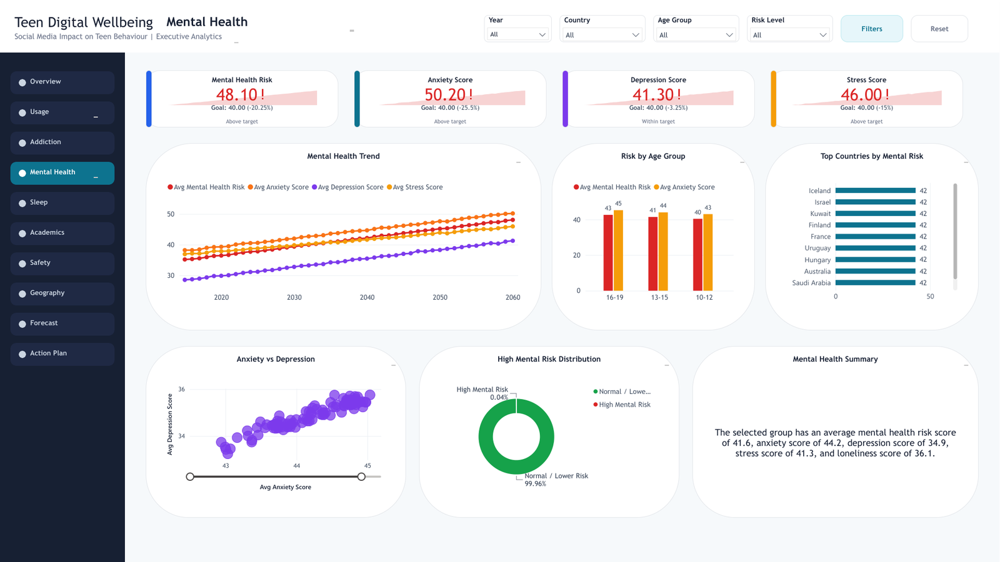
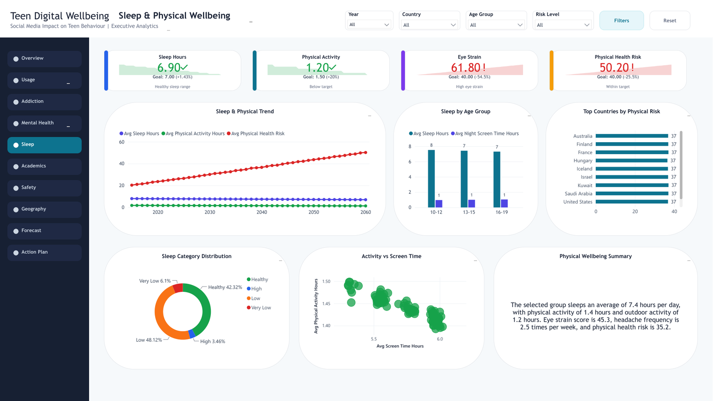
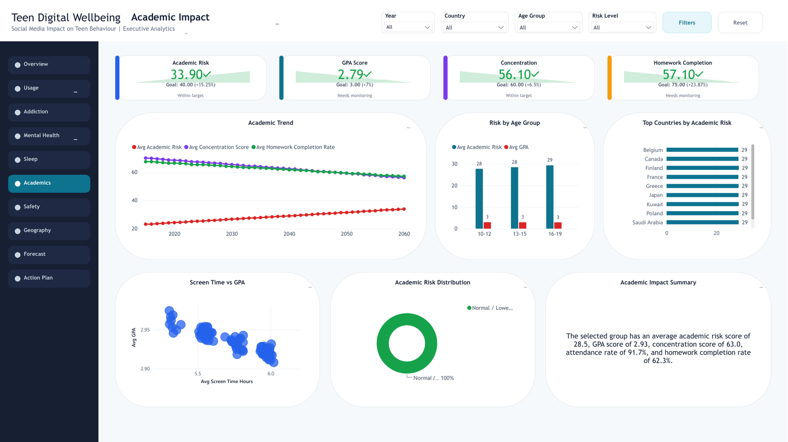
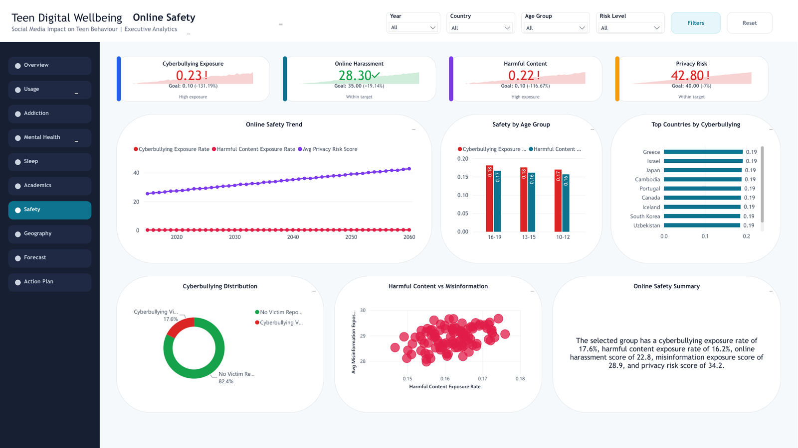
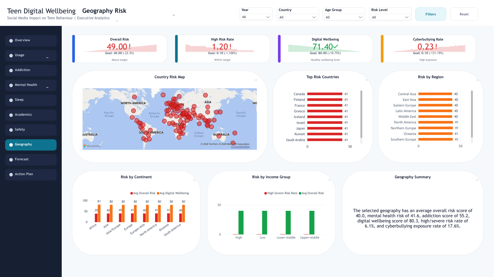
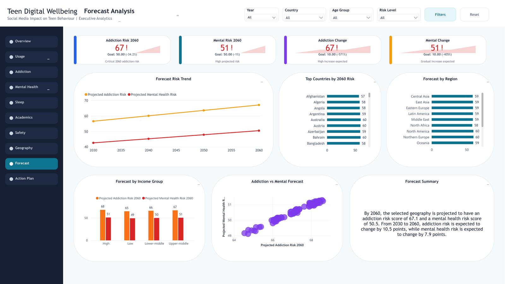
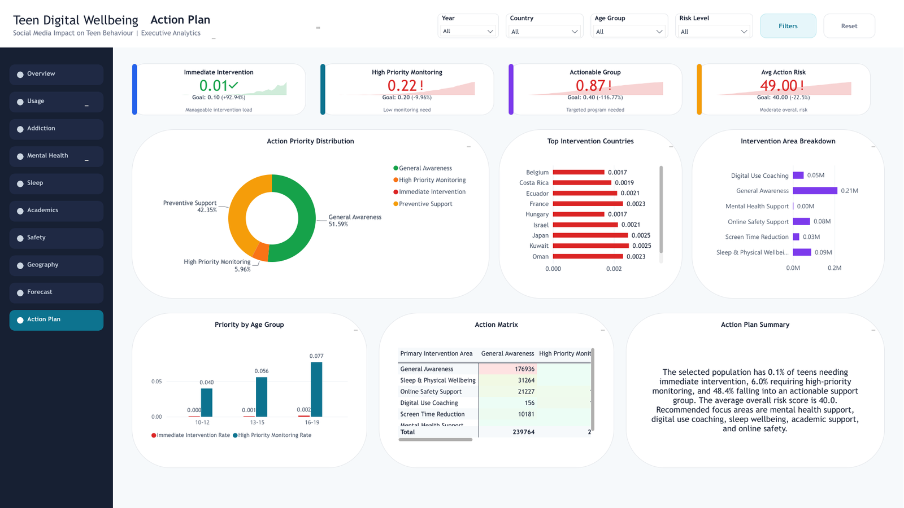

# Teen Digital Wellbeing Analytics Dashboard


## Project Overview

**Teen Digital Wellbeing Analytics** is a Power BI dashboard project analyzing the impact of social media and screen usage on teen behaviour from **2015 to 2060**. The report covers usage patterns, addiction dependency, mental health, sleep and physical wellbeing, academic impact, online safety, geography-based risk, forecast trends, and action planning.

The dashboard is designed as an executive analytics solution with interactive navigation, slicers, KPI cards, trend analysis, risk segmentation, country-level insights, and business action recommendations.

> Dataset type: Synthetic teen behaviour dataset  
> Report pages included: Pages **1-10**  
> Main tool: Microsoft Power BI Desktop + Power BI Service

---

## Business Problem

Teen digital behaviour is influenced by screen time, social media usage, notifications, sleep habits, online safety exposure, academic performance, and mental health indicators. Decision-makers need a structured dashboard to identify:

- High-risk teen segments
- Countries and regions with elevated wellbeing risk
- Addiction and dependency trends
- Mental health and sleep risk signals
- Online safety exposure
- Forecasted risk for future years
- Actionable intervention priorities

---

## Dashboard Preview

### 1. Executive Summary



The executive page provides the overall health of the report, including screen time, social media hours, addiction score, mental risk, sleep hours, high-risk rate, top countries, feature importance, and executive insights.

### 2. Usage Analysis



This page analyzes screen time trends, social media usage, night screen time, notifications, age-group usage, platform usage, and screen category distribution.

### 3. Addiction Dependency



This page focuses on addiction score, smartphone dependency, FOMO score, problematic use rate, platform-level addiction, and problematic usage distribution.

### 4. Mental Health



This page tracks mental health risk, anxiety, depression, stress, loneliness, high mental risk distribution, and country-level mental health risk.

### 5. Sleep & Physical Wellbeing



This page explains sleep hours, physical activity, eye strain, physical health risk, sleep category distribution, and activity vs screen time patterns.

### 6. Academic Impact



This page studies academic risk, GPA, concentration, homework completion, screen time vs GPA, and academic risk distribution.

### 7. Online Safety



This page covers cyberbullying exposure, harmful content, online harassment, misinformation, privacy risk, and cyberbullying distribution.

### 8. Geography Risk



This page shows country, region, continent, and income-group risk patterns using maps, ranked countries, and geography summaries.

### 9. Forecast Analysis



This page shows projected addiction and mental health risk for 2030, 2040, 2050, and 2060.

### 10. Action Plan



This final page converts insights into intervention priorities: immediate intervention, high-priority monitoring, actionable groups, intervention areas, and action matrix.

---

## Key Features

- Executive summary with business-ready KPIs
- Left-side page navigation
- Global slicers for Year, Country, Age Group, and Risk Level
- Risk level distribution and country-level ranking
- Forecast analysis for 2030-2060
- Interactive maps and scatter plots
- Action plan page for decision-making
- Star-schema semantic model
- DAX measure catalog for KPIs, targets, and status indicators
- Dev -> Stage -> Prod deployment-ready structure

---

## Report Pages

| Page | Page Name | Purpose |
|---:|---|---|
| 01 | Executive Summary | High-level view of digital wellbeing and risk |
| 02 | Usage Analysis | Screen time, social media, notifications, and platform usage |
| 03 | Addiction Dependency | Addiction, smartphone dependency, FOMO, and problematic use |
| 04 | Mental Health | Anxiety, depression, stress, loneliness, and mental risk |
| 05 | Sleep & Physical Wellbeing | Sleep, physical activity, eye strain, and physical risk |
| 06 | Academic Impact | GPA, concentration, attendance, homework, and academic risk |
| 07 | Online Safety | Cyberbullying, harmful content, harassment, privacy risk |
| 08 | Geography Risk | Country, continent, region, and income-group risk analysis |
| 09 | Forecast Analysis | Projected addiction and mental risk through 2060 |
| 10 | Action Plan | Intervention priorities and action matrix |

---

## Dataset and Tables

The project uses a synthetic dataset with teen behaviour records and supporting summary/forecast tables.

### Main Fact Tables

| Table | Description |
|---|---|
| `FactTeenBehaviour` | Main record-level teen behaviour dataset |
| `FactPlatformUsage` | Unpivoted platform usage table |
| `FactForecastLong` | Forecasted addiction and mental health risk |
| `FactFeatureImportance` | Model driver / feature importance values |
| `FactCountryYearSummary` | Country-year summary metrics |
| `FactCountryRisk2026` | Country-level 2026 risk profile |
| `FactRegionRisk2026` | Region-level 2026 risk profile |

### Dimension Tables

| Table | Description |
|---|---|
| `DimDate` | Calendar/year dimension |
| `DimCountry` | Country, continent, region, and income group |
| `DimDemographic` | Age group and gender |
| `DimRisk` | Risk level dimension |
| `DimIncomeGroup` | Income group ordering |
| `DimUrbanRural` | Urban/rural grouping |
| `DimPlatformUsage` | Platform lookup |
| `DimForecastYear` | Forecast years 2030, 2040, 2050, 2060 |

---

## Data Model Design

The dashboard follows a **star schema** design.

Recommended relationship principles:

- Use dimension tables to filter fact tables.
- Keep relationships single-direction unless a specific analytical requirement exists.
- Avoid direct fact-to-fact relationships.
- Use `DimCountry` as the geography hub.
- Use `DimForecastYear` for forecast pages instead of connecting forecast data to daily `DimDate`.
- Keep staging queries disabled from report load when not needed.

---

## Important DAX Measures

### Core Measures

```DAX
Teen Records =
COUNTROWS ( FactTeenBehaviour )

Avg Screen Time Hours =
AVERAGE ( FactTeenBehaviour[daily_screen_time_hours] )

Avg Social Media Hours =
AVERAGE ( FactTeenBehaviour[social_media_hours] )

Avg Addiction Score =
AVERAGE ( FactTeenBehaviour[social_media_addiction_score] )

Avg Mental Health Risk =
AVERAGE ( FactTeenBehaviour[mental_health_risk_score] )

Avg Sleep Hours =
AVERAGE ( FactTeenBehaviour[sleep_hours] )

Avg Overall Risk =
AVERAGE ( FactTeenBehaviour[overall_risk_score] )
```

### Risk Measures

```DAX
High Severe Risk Records =
CALCULATE (
    [Teen Records],
    FactTeenBehaviour[risk_level] IN { "High", "Severe" }
)

High Severe Risk Rate =
DIVIDE ( [High Severe Risk Records], [Teen Records] )

Problematic Use Records =
CALCULATE (
    [Teen Records],
    FactTeenBehaviour[problematic_use_flag] = 1
)

Problematic Use Rate =
DIVIDE ( [Problematic Use Records], [Teen Records] )
```

### Online Safety Measures

```DAX
Cyberbullying Exposure Records =
CALCULATE (
    [Teen Records],
    FactTeenBehaviour[cyberbullying_victim] = 1
)

Cyberbullying Exposure Rate =
DIVIDE ( [Cyberbullying Exposure Records], [Teen Records] )

Harmful Content Exposure Records =
CALCULATE (
    [Teen Records],
    FactTeenBehaviour[harmful_content_exposure] = 1
)

Harmful Content Exposure Rate =
DIVIDE ( [Harmful Content Exposure Records], [Teen Records] )
```

### Forecast Measures

```DAX
Projected Risk =
AVERAGE ( FactForecastLong[projected_risk] )

Projected Addiction Risk =
CALCULATE (
    [Projected Risk],
    FactForecastLong[risk_type] = "Addiction Risk"
)

Projected Mental Health Risk =
CALCULATE (
    [Projected Risk],
    FactForecastLong[risk_type] = "Mental Health Risk"
)

Projected Addiction Risk 2060 =
CALCULATE (
    [Projected Addiction Risk],
    FactForecastLong[forecast_year] = 2060
)

Projected Mental Health Risk 2060 =
CALCULATE (
    [Projected Mental Health Risk],
    FactForecastLong[forecast_year] = 2060
)
```

### Action Plan Measures

```DAX
Immediate Intervention Records =
CALCULATE (
    [Teen Records],
    FactTeenBehaviour[Action Priority] = "Immediate Intervention"
)

Immediate Intervention Rate =
DIVIDE (
    [Immediate Intervention Records],
    [Teen Records]
)

Actionable Records =
CALCULATE (
    [Teen Records],
    FactTeenBehaviour[Action Priority]
        IN {
            "Immediate Intervention",
            "High Priority Monitoring",
            "Preventive Support"
        }
)

Actionable Rate =
DIVIDE (
    [Actionable Records],
    [Teen Records]
)
```

---

## Calculated Columns

### Action Priority

```DAX
Action Priority =
SWITCH (
    TRUE (),
    FactTeenBehaviour[risk_level] = "Severe"
        || FactTeenBehaviour[overall_risk_score] >= 70,
        "Immediate Intervention",

    FactTeenBehaviour[risk_level] = "High"
        || FactTeenBehaviour[overall_risk_score] >= 55,
        "High Priority Monitoring",

    FactTeenBehaviour[risk_level] = "Medium"
        || FactTeenBehaviour[overall_risk_score] >= 40,
        "Preventive Support",

    "General Awareness"
)
```

### Primary Intervention Area

```DAX
Primary Intervention Area =
SWITCH (
    TRUE (),
    FactTeenBehaviour[high_mental_health_risk_flag] = 1,
        "Mental Health Support",

    FactTeenBehaviour[high_academic_risk_flag] = 1,
        "Academic Support",

    FactTeenBehaviour[cyberbullying_victim] = 1,
        "Online Safety Support",

    FactTeenBehaviour[problematic_use_flag] = 1,
        "Digital Use Coaching",

    FactTeenBehaviour[sleep_hours] < 7,
        "Sleep & Physical Wellbeing",

    FactTeenBehaviour[daily_screen_time_hours] >= 7,
        "Screen Time Reduction",

    "General Awareness"
)
```

---

## Deployment Architecture

Recommended Power BI Service deployment structure:

```text
Development Workspace
        ↓
Stage Workspace
        ↓
Production Workspace
        ↓
Power BI App
```

### Workspace Naming

| Stage | Workspace |
|---|---|
| Development | `Teen Digital Wellbeing - DEV` |
| Stage | `Teen Digital Wellbeing - STAGE` |
| Production | `Teen Digital Wellbeing - PROD` |

### Deployment Best Practices

- Publish PBIX only to DEV.
- Deploy Report + Semantic Model together.
- Use **Select related** in deployment pipeline.
- Disable partial deployment if one item fails.
- Validate Stage before promoting to Production.
- Create or update Power BI App only from Production workspace.
- Keep Build permission off for portfolio/recruiter audiences.

---

## Power BI App Configuration

Recommended app setup:

| Setting | Value |
|---|---|
| App Name | `Teen Digital Wellbeing Analytics` |
| Source Workspace | Production |
| Audience | Portfolio / Recruiter View |
| Permission | View only |
| Build with semantic model | Off |
| Share permission | Off |

---

## Refresh and Data Source Notes

This project uses synthetic/static data. For portfolio use:

- Keep scheduled refresh off unless the source is moved to OneDrive, SharePoint, Lakehouse, or a gateway-supported location.
- If using deployment pipelines, verify semantic model credentials in each workspace.
- If visuals break after deployment, clean the Stage/Prod workspace and redeploy the report and semantic model together.

---

## Common Troubleshooting

| Issue | Likely Cause | Fix |
|---|---|---|
| Visuals work in DEV but break in STAGE | Report not correctly bound to semantic model | Delete broken STAGE items and redeploy using Select related |
| Semantic model not visible in app content | Expected behaviour | Add report only; semantic model stays behind the report |
| Forecast cards error | KPI visual used with fixed 2060 measure | Use Card visual instead of KPI visual |
| Warning icons in model view | Service metadata/model warning | Validate report visuals and refresh history |
| Refresh succeeds but visuals break | Deployment binding issue | Clean redeploy Report + Semantic Model together |
| Semantic model not copied | Only report deployed | Deploy related report and semantic model together |

---

## Repository Structure

```text
.
├── README.md
├── Social_Media_Impact_on_Teen_Behaviour_2015_2060.pbix
├── docs/
│   └── Teen_Digital_Wellbeing_Team_Documentation.pdf
├── assets/
│   └── screenshots/
│       ├── 01_executive_summary.png
│       ├── 02_usage_analysis.png
│       ├── 03_addiction_dependency.png
│       ├── 04_mental_health.png
│       ├── 05_sleep_physical_wellbeing.png
│       ├── 06_academic_impact.png
│       ├── 07_online_safety.png
│       ├── 08_geography_risk.png
│       ├── 09_forecast_analysis.png
│       └── 10_action_plan.png
└── data/
    └── source files or dataset reference
```

---

## How to Use

1. Open the `.pbix` file in Power BI Desktop.
2. Review and refresh the model.
3. Publish to DEV workspace.
4. Deploy DEV -> STAGE -> PROD using deployment pipelines.
5. Validate the Production report.
6. Create or update the Power BI App from Production workspace.

---

## Skills Demonstrated

- Power BI dashboard development
- Data modeling and star schema design
- DAX measures and calculated columns
- KPI target and status logic
- Forecast analysis
- Data storytelling
- Deployment pipeline management
- Power BI Service app distribution
- Business action planning
- Report documentation for team handover

---

## Author

**Prakhar Tated**  
Power BI / Data Analytics Portfolio Project
